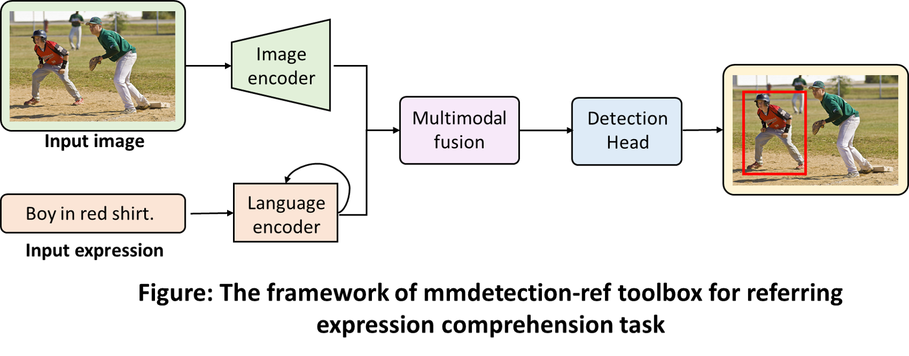

# MMDetection-Ref: An Open-Source Referring Grounding Toobox
<div align="center">
  
</div>

## Introduction  
MMDetection-Ref is an open-source referring grounding toobox based on [MMDetection](https://github.com/open-mmlab/mmdetection), which flexibly supports the integration of natural language and various visual detectors for end-to-end referring expression comprehension task.

## Installation
* Linux or macOS (Windows is in experimental support)
* MMDetection
* pytorch
* Python 3.6+
* PyTorch 1.3+
* CUDA 9.2+ (If you build PyTorch from source, CUDA 9.0 is also compatible)
* GCC 5+

1. Please see [get_started.md](https://github.com/QiuHeqian/mmdetection-ref/blob/master/docs/get_started.md) for installation and the basic usage of MMDetection-Ref.

2. Clone the repository and then install it: 
``` 
git clone https://github.com/QiuHeqian/mmdetection-ref.git
cd mmdetection-ref  
pip install -v -e .  # or "python setup.py develop"  
```
3. Download the [RefCoco annotations](https://drive.google.com/drive/u/0/folders/16VnoB4Ja5kilp2XeLxNL0dAikNQdL7Ge) and the images ([train2014 of MS-COCO dataset](http://images.cocodataset.org/zips/train2014.zip)), please place them in 'data/RefCoco'.
4. If you want to download [RefCrowd dataset](https://qiuheqian.github.io/datasets/refcrowd/) for grounding person in crowd, you requires to sign [RefCrowd Terms of Use](https://docs.google.com/forms/d/e/1FAIpQLSeWgI0mzT1OFrhEthLZLURvuC-he_Hy882nEnCzhiM6DAoFEg/viewform?usp=sf_link) as restrictions on access to dataset to privacy protection and use dataset for non-commercial research and/or educational purposes. After downloading RefCrowd dataset, please place them in 'data/RefCrowd'.
```
mmdetection-ref
├── data
│   ├── RefCoco
│   │   ├── refcoco
│   │   │   ├── train.json
│   │   │   ├── val.json
│   │   │   ├── testA.json
│   │   │   ├── testB.json
│   │   ├── refcoco+
│   │   │   ├── train.json
│   │   │   ├── val.json
│   │   │   ├── testA.json
│   │   │   ├── testB.json
│   │   ├── refcocog
│   │   │   ├── train.json
│   │   │   ├── val.json
│   │   │   ├── test.json
│   │   ├── train2014
│   ├── RefCrowd
│   │   ├── annotations
│   │   │   ├── train.json
│   │   │   ├── val.json
│   │   │   ├── test.json
│   │   ├── images
│   │   │   ├── train
│   │   │   ├── val
│   │   │   ├── test

```
5. Pretrain Models: download the [pretrained models](https://drive.google.com/drive/u/0/folders/1uAxYujoKWIDngG5VpNzpKlb5KJTuzBdw) and place the file in 'pretrained_models/'. You can get two types of pretrained models: [coco_train](https://drive.google.com/drive/u/0/folders/1uAxYujoKWIDngG5VpNzpKlb5KJTuzBdw) indicates models are trained using all COCO training data, [coco_train_minus_refer](https://drive.google.com/drive/u/0/folders/1uAxYujoKWIDngG5VpNzpKlb5KJTuzBdw) indicates models are trained excluding COCO training data in RefCOCO, RefCOCO+, and RefCOCOg’s validation+testing.

You can modify resume_from in corresponding config file to change the pretrained models.
```
# assume that you want to use the config file 'configs/referring_grounding/refcoco/fcos_r101_refcoco.py', you can change:
load_from='pretrained_models/coco_train_minus_refer/fcos_r101.pth' #pretrained_models
```
## Train  
```
# assume that you are under the root directory of this project,
# and you have activated your virtual environment if needed.
# and with COCO dataset in 'data/dataset/coco/'.
./tools/dist_train.sh configs/crossdet/crossdet_r50_fpn_1x_coco.py 8
```
```
# assume that you are under the root directory of this project,
# and you have activated your virtual environment if needed.
# and with VOC dataset in 'data/dataset/VOCdevkit/'.
./tools/dist_train.sh configs/crossdet/crossdet_r50_fpn_1x_voc.py 8
```

## Inference
```
./tools/dist_test.sh configs/crossdet/crossdet_r50_fpn_1x_coco.py work_dirs/crossdet_r50_fpn_1x_coco/epoch_12.pth 8 --eval bbox
```
## Acknowledgement
Thanks MMDetection team for the wonderful open source project!

## Citition
If you find CrossDet useful in your research, please consider citing:  
```
@inproceedings{qiu2021crossdet,  
  title={CrossDet: Crossline Representation for Object Detection},  
  author={Qiu, Heqian and Li, Hongliang and Wu, Qingbo and Cui, Jianhua and Song, Zichen and Wang, Lanxiao and Zhang, Minjian},  
  booktitle={Proceedings of the IEEE/CVF International Conference on Computer Vision},  
  pages={3195--3204},  
  year={2021}  
}  
```
